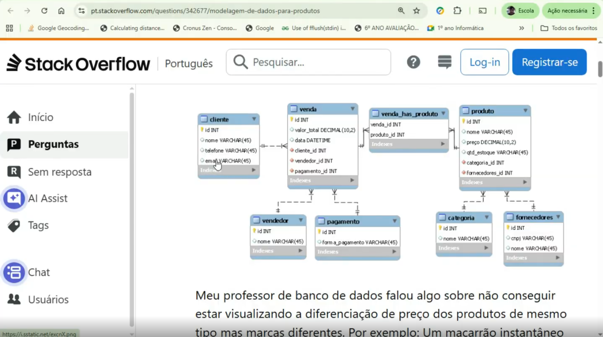

- 3 à 5 Minutos de apresentação.

- Apresentação dos Integrantes do grupo.
  - Foto, Nome, RA, Curso.
    - {Nome do fulano e oq ele fez no trabalho}

- Apresentação do problema.

- Apresentação do problema

- Apresentação do cliente / público alvo.

- Apresentação do objetivo do aplicativo.

- Apresentação do banco de dados (protótipo visual).
  - Diagrama do banco de dados.

- Apresentação da interface gráfica / funcionamento do aplicativo (protótipo).

- Conclusão do Projeto.
  - O que foi aprendido.
  - Filosofia do projeto.

- Encerramento do vídeo.
  - considerações finais e finalização.
